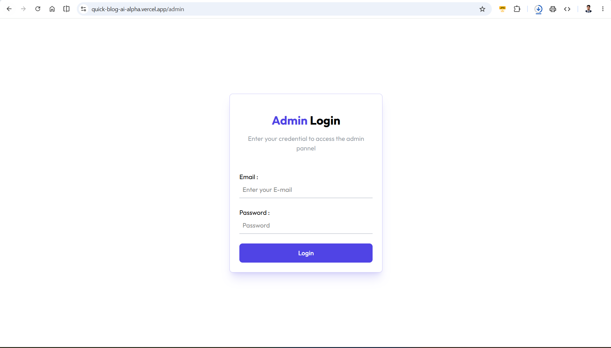
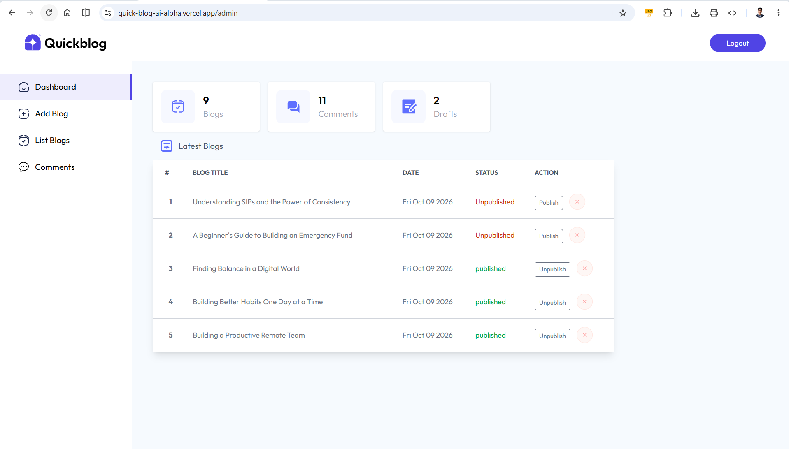
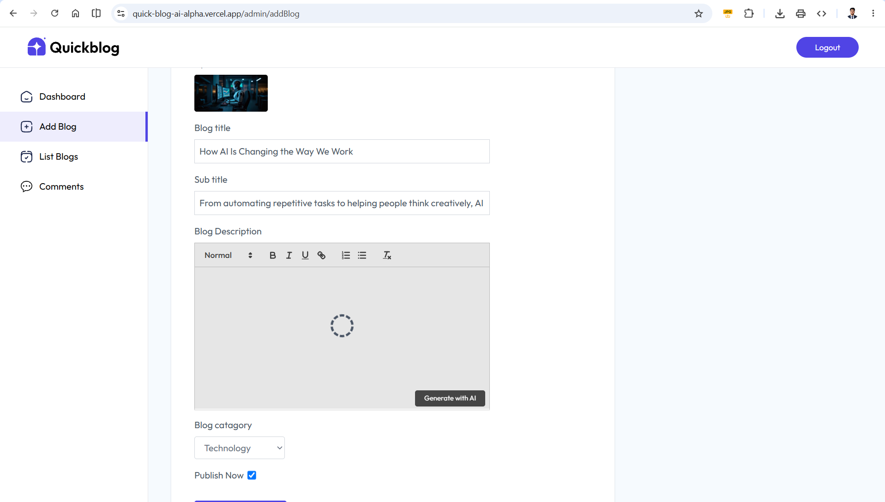

# QuickBlog — AI-Powered Full-Stack Blogging Platform

QuickBlog is a full-stack blogging web application built with **React, Tailwind CSS, Node.js, Express.js, and MongoDB**. It provides a platform where readers can explore published blog posts, search and filter articles, read complete blog content, and leave comments.

The application also includes a dedicated admin dashboard for managing blog posts, moderating comments, tracking dashboard statistics, uploading blog thumbnails, and generating blog content with Google's Gemini AI.

This project was developed as my first full-stack application to gain practical experience with frontend development, REST APIs, database integration, authentication, file uploads, third-party services, and AI integration.

---

## 🚀 Live Project Demo

Explore the deployed QuickBlog application and try out its available features.

**Live Website:** [QuickBlog — AI-Powered Blogging Platform](https://quick-blog-ai-alpha.vercel.app/)

[](https://quick-blog-ai-alpha.vercel.app/)

> Note: Some features, such as admin login, AI content generation, and image uploads, require the backend and relevant third-party services to be configured and available.

---

## 📸 Screenshots

Here are some screenshots showcasing the user interface and features of QuickBlog.

<!-- Replace the placeholder paths with your actual screenshot filenames. -->

### 🏠 Home Page

<!-- Add a screenshot of the homepage here. -->


### 📝 Blog Details Page

<!-- Add a screenshot of an individual blog post here. -->


### 🔐 Admin Login

<!-- Add a screenshot of the admin login page here. -->



### 📊 Admin Dashboard

<!-- Add a screenshot of the admin dashboard here. -->



### ✍️ Create Blog with AI

<!-- Add a screenshot of the blog editor and AI content generation feature here. -->



### 💬 Comment Moderation

<!-- Add a screenshot of the admin comment management page here. -->


---

## 🎥 Project Demo Video

Watch the complete QuickBlog project demonstration to explore the application's frontend, admin dashboard, blog management workflow, comment moderation, and AI-powered content generation.

**Demo Video:** [Comming soon!](#)

<!-- To embed a YouTube thumbnail, replace YOUR_VIDEO_ID with your actual YouTube video ID. -->

<!-- [](https://www.youtube.com/watch?v=YOUR_VIDEO_ID) -->

The demonstration can cover:

- Exploring the homepage and published blogs.
- Searching articles and filtering by category.
- Opening and reading individual blog posts.
- Submitting a comment.
- Logging into the admin dashboard.
- Creating a blog with a thumbnail.
- Generating blog content using Gemini AI.
- Publishing, unpublishing, and deleting blog posts.
- Approving and managing comments.

---

## Table of Contents

- [Project Overview](#project-overview)
- [Features](#features)
- [Technology Stack](#technology-stack)
- [Application Architecture](#application-architecture)
- [Project Folder Structure](#project-folder-structure)
- [How the Application Works](#how-the-application-works)
- [Frontend Documentation](#frontend-documentation)
- [Backend Documentation](#backend-documentation)
- [Database Models](#database-models)
- [REST API Documentation](#rest-api-documentation)
- [Authentication and Authorization](#authentication-and-authorization)
- [AI Content Generation](#ai-content-generation)
- [Image Upload Workflow](#image-upload-workflow)
- [Environment Variables](#environment-variables)
- [Installation and Setup](#installation-and-setup)
- [Running the Application](#running-the-application)
- [Testing the API](#testing-the-api)
- [Security Considerations](#security-considerations)
- [Current Limitations](#current-limitations)
- [Future Improvements](#future-improvements)
- [Learning Outcomes](#learning-outcomes)
- [Author](#author)

---

## Project Overview

QuickBlog is designed around two main experiences:

### 1. Public Blogging Platform

Readers can access the website without logging in. They can browse published articles, filter posts by category, search for blogs by title or category, read individual articles, and submit comments for moderation.

### 2. Admin Dashboard

The admin dashboard provides a centralized interface for managing the application's content. The administrator can create blog posts, generate draft content using AI, upload thumbnails, publish or unpublish articles, delete posts, and approve or delete comments.

The backend handles API requests, authentication, database operations, image uploads, and communication with the AI service.

### Project Goals

The primary goals of this project are to:

- Build a complete React frontend connected to an Express backend.
- Design and implement RESTful API endpoints.
- Store and retrieve application data using MongoDB and Mongoose.
- Implement administrator authentication using JSON Web Tokens (JWT).
- Handle multipart form submissions and file uploads with Multer.
- Integrate ImageKit for image hosting and optimization.
- Integrate Google's Gemini API for AI-assisted blog writing.
- Implement comment moderation and publishing workflows.
- Manage shared frontend state using React Context.
- Handle API responses, loading states, and user feedback.

---

## Features

### Public Website

- Responsive homepage with a hero section.
- Display of published blog posts.
- Blog cards showing article titles, categories, thumbnails, and short descriptions.
- Category-based filtering.
- Search blogs by title or category.
- Individual blog detail pages.
- Rich-text blog content rendering.
- Article publication dates.
- Comment submission.
- Display of approved comments.
- Relative timestamps for comments.
- Social media sharing icons.
- Newsletter subscription interface.
- Toast notifications for API feedback.

### Admin Dashboard

- Admin login with email and password.
- JWT-based authentication.
- Persistent login token using browser local storage.
- Dashboard statistics for blogs, comments, and drafts.
- Display of the five most recent blog posts.
- Create blog posts using a rich-text editor.
- Upload blog thumbnails.
- Select blog categories.
- Publish articles immediately or save them as drafts.
- Generate blog content using Gemini AI.
- View all blog posts.
- Publish or unpublish existing articles.
- Delete blog posts.
- View submitted comments.
- Filter comments by approval status.
- Approve comments before public display.
- Delete comments.
- Logout functionality.

### Backend and Integrations

- REST API built with Express.js.
- MongoDB integration using Mongoose.
- JWT verification middleware.
- Multipart file handling with Multer.
- ImageKit image hosting.
- Image transformation for optimized delivery.
- Gemini AI content generation.
- Automatic timestamps for blog posts and comments.
- Removal of comments associated with a deleted blog post.
- Centralized frontend API configuration using Axios.

---

## Technology Stack

### Frontend

| Technology        | Purpose                                              |
| ----------------- | ---------------------------------------------------- |
| React             | Component-based user interface                       |
| Vite              | Frontend development server and build tooling        |
| React Router DOM  | Client-side routing                                  |
| Tailwind CSS      | Utility-first styling and responsive layouts         |
| Axios             | HTTP requests to the backend                         |
| React Context API | Shared application state                             |
| React Hot Toast   | Success and error notifications                      |
| Quill             | Rich-text blog editor                                |
| Marked            | Convert generated Markdown into HTML                 |
| Motion            | Animations and interactive transitions               |
| Moment.js         | Formatting publication dates and relative timestamps |

### Backend

| Technology           | Purpose                                       |
| -------------------- | --------------------------------------------- |
| Node.js              | JavaScript runtime                            |
| Express.js           | HTTP server and API routing                   |
| MongoDB              | Database                                      |
| Mongoose             | MongoDB object modeling and schema validation |
| JSON Web Token (JWT) | Admin authentication                          |
| Multer               | Handling multipart file uploads               |
| dotenv               | Loading environment variables                 |
| CORS                 | Cross-origin request configuration            |
| Axios                | Used by the frontend for API communication    |

### External Services

| Service           | Purpose                                |
| ----------------- | -------------------------------------- |
| MongoDB Atlas     | Cloud-hosted MongoDB database          |
| ImageKit          | Image hosting and image transformation |
| Google Gemini API | AI-assisted blog content generation    |

---

## Application Architecture

QuickBlog follows a client-server architecture.

```text
                    QUICKBLOG
                        |
           +------------+------------+
           |                         |
      React Frontend             Express Backend
           |                         |
      React Router              API Routes
           |                         |
      React Context             Controllers
           |                         |
          Axios              Authentication
           |                   Middleware
           |                         |
           +---------- HTTP ----------+
                                     |
                      +--------------+--------------+
                      |              |              |
                   MongoDB        ImageKit      Gemini AI
                   Database      Image Hosting  Text Generation
```

### Frontend Responsibilities

The frontend is responsible for rendering the user interface, collecting user input, maintaining application state, sending API requests, displaying responses, and navigating between pages.

### Backend Responsibilities

The backend validates incoming data, authenticates protected requests, executes business logic, interacts with MongoDB, uploads images to ImageKit, and requests generated content from Gemini.

### Database Responsibilities

MongoDB stores blog posts and comments. Mongoose schemas define the structure of these documents and their relationships.

---

## Project Folder Structure

The following structure is inferred from the source files provided. Some configuration files and folders may differ in the actual repository.

```text
QuickBlog/
│
├── client/                         # React frontend
│   │
│   ├── public/
│   │
│   ├── src/
│   │   │
│   │   ├── assets/
│   │   │   └── assets.js            # Images, icons, categories,
│   │   │                            # footer data and sample data
│   │   │
│   │   ├── Components/
│   │   │   ├── Navbar.jsx
│   │   │   ├── Header.jsx
│   │   │   ├── BlogCard.jsx
│   │   │   ├── BlogList.jsx
│   │   │   ├── Footer.jsx
│   │   │   ├── Newsletter.jsx
│   │   │   ├── Loader.jsx
│   │   │   │
│   │   │   └── admin/
│   │   │       ├── Login.jsx
│   │   │       ├── Sidebar.jsx
│   │   │       ├── BlogTableItem.jsx
│   │   │       └── CommentTableItem.jsx
│   │   │
│   │   ├── context/
│   │   │   └── AppContext.jsx       # Shared application state
│   │   │
│   │   ├── Pages/
│   │   │   ├── Home.jsx
│   │   │   ├── Blog.jsx
│   │   │   │
│   │   │   └── admin/
│   │   │       ├── Layout.jsx
│   │   │       ├── Dashboard.jsx
│   │   │       ├── AddBlog.jsx
│   │   │       ├── ListBlog.jsx
│   │   │       └── Comments.jsx
│   │   │
│   │   ├── App.jsx                  # Application routes
│   │   ├── main.jsx                 # React entry point
│   │   └── index.css                # Global styles
│   │
│   ├── .env                         # Frontend environment variables
│   ├── index.html
│   ├── package.json
│   ├── package-lock.json
│   └── vite.config.js
│
├── server/                          # Express backend
│   │
│   ├── config/
│   │   ├── db.js                    # MongoDB connection
│   │   ├── gemini.js                # Gemini AI configuration
│   │   └── imagekit.js              # ImageKit configuration
│   │
│   ├── controllers/
│   │   ├── adminController.js       # Admin operations
│   │   └── blogController.js        # Blog and comment operations
│   │
│   ├── middleweres/
│   │   ├── auth.js                  # JWT verification
│   │   └── multer.js                # File upload configuration
│   │
│   ├── models/
│   │   ├── blog.js                  # Blog schema
│   │   └── comment.js               # Comment schema
│   │
│   ├── routes/
│   │   ├── adminRoutes.js           # Admin API routes
│   │   └── blogRoutes.js            # Blog API routes
│   │
│   ├── .env                         # Backend environment variables
│   ├── package.json
│   ├── package-lock.json
│   └── server.js                    # Express application entry point
│
└── README.md
```

**Note:** The backend directory is named `middleweres` in the supplied imports. The tree preserves that spelling so the documentation matches the current code. If the directory is renamed to `middlewares`, update all corresponding import paths.

The `client` and `server` directory names are illustrative. Adjust them if the actual repository uses different names.

---

## How the Application Works

### 1. Loading the Homepage

When a visitor opens QuickBlog:

1. React renders the homepage.
2. The `AppProvider` initializes shared application state.
3. The frontend sends a `GET /api/blog/all` request through Axios.
4. The backend queries MongoDB for published blog posts.
5. The API returns the matching blog documents.
6. The context stores the returned blogs in React state.
7. `BlogList` renders the blog cards.

### 2. Searching and Filtering Blogs

The homepage supports two types of filtering.

**Search filtering:** The search input updates the shared `input` state. `BlogList` filters the available blogs by matching the search text against article titles and categories, ignoring letter case.

**Category filtering:** The category selector maintains its own `menu` state. Selecting a category displays only the matching posts. Selecting `All` displays every published post that matches the search.

Both filters operate on the blogs already loaded into frontend state; they do not issue a new API request for each keystroke.

### 3. Reading a Blog

When a visitor selects a blog card:

1. React Router navigates to `/blog/:_id`.
2. The `Blog` page extracts the blog ID using `useParams()`.
3. The frontend requests the individual blog using `GET /api/blog/getBlog`.
4. The frontend separately requests approved comments using `GET /api/blog/comments`.
5. The returned article is displayed with its title, subtitle, publication date, image, and rich-text description.
6. Approved comments are displayed below the article.

### 4. Submitting a Comment

When a visitor submits a comment:

1. The frontend collects the visitor's name and comment text.
2. It sends a `POST /api/blog/add-comment` request.
3. The backend creates a comment document in MongoDB.
4. The comment's `isApproved` field defaults to `false`.
5. The visitor receives a response indicating that the comment was submitted for review.
6. The comment remains hidden from the public page until an administrator approves it.

### 5. Admin Login

1. The administrator enters the configured email address and password.
2. The frontend sends a `POST /api/admin/login` request.
3. The backend compares the supplied credentials with the configured environment variables.
4. If the credentials match, the backend signs a JWT containing the administrator's email.
5. The frontend stores the token in local storage and updates the shared context.
6. Axios attaches the token to the `Authorization` header for subsequent requests.
7. The admin routes become available when the frontend has a token.

### 6. Creating a Blog

1. The administrator enters a title and subtitle.
2. The administrator writes the description in the Quill rich-text editor or generates content using AI.
3. A category is selected.
4. A thumbnail image is selected.
5. The publication checkbox determines whether the post should be published or saved as a draft.
6. The frontend creates a `FormData` object containing the serialized blog data and image.
7. The request is sent to `POST /api/blog/add`.
8. Multer processes the uploaded image.
9. The backend validates the required fields and uploads the image to ImageKit.
10. A new blog document is saved in MongoDB.
11. The frontend displays a success notification and refreshes the published blog list.

### 7. Managing Blogs and Comments

The administrator can retrieve all blogs, change their publication status, and delete individual posts.

Comment moderation is handled separately. The administrator can view comments, filter them by approval status, approve pending comments, and delete comments.

When a blog is deleted successfully, its associated comments are also deleted.

---

## Frontend Documentation

### Application Entry Point

**`src/main.jsx`**

This file initializes the React application using `createRoot()` and wraps the application with `BrowserRouter` and `AppProvider`.

`BrowserRouter` enables client-side navigation, while `AppProvider` makes shared application state available to components throughout the application.

### Routing

**`src/App.jsx`**

React Router defines the following pages:

| Route             | Purpose                       |
| ----------------- | ----------------------------- |
| `/`               | Public homepage               |
| `/blog/:_id`      | Individual blog page          |
| `/admin`          | Admin dashboard or login page |
| `/admin/addBlog`  | Create a blog                 |
| `/admin/ListBlog` | Manage existing blogs         |
| `/admin/Comments` | Moderate comments             |

The admin routes are nested under the admin layout. The application uses the presence of a frontend token to determine whether to display the admin layout or login component.

This is a frontend navigation check, not a substitute for backend authentication. The backend must independently validate tokens on protected endpoints.

### Shared Application State

**`src/context/AppContext.jsx`**

The React Context API provides shared values and functions through `useAppContext()`.

| State or value        | Responsibility                         |
| --------------------- | -------------------------------------- |
| `axios`               | Configured Axios instance              |
| `navigate`            | React Router navigation function       |
| `token`               | Current frontend authentication token  |
| `setToken`            | Updates the authentication token       |
| `blogs`               | Published blogs retrieved from the API |
| `setBlogs`            | Updates the blog collection            |
| `input`               | Shared search input                    |
| `setInput`            | Updates the search input               |
| `fetcPublishedhBlogs` | Retrieves published blogs              |

The context also configures Axios with the frontend API base URL using `VITE_BASE_URL`.

On initial application load, it fetches published blogs and checks local storage for a saved token. If a token exists, it restores that token to React state and sets the Axios authorization header.

### Homepage Components

**`Header.jsx`**

Displays the main introduction, AI-related promotional text, and blog search input. The search input updates the shared context state.

**`BlogList.jsx`**

Renders category filters and filters blog data by the selected category and search input.

**`BlogCard.jsx`**

Displays a blog's category, title, thumbnail, and a short description. Selecting the card navigates to the corresponding blog detail page.

**`Navbar.jsx`**

Displays the application logo and a button that directs the visitor to the admin area. The button label changes according to the frontend token state.

**`Footer.jsx`**

Displays footer information and navigation links.

**`Newsletter.jsx`**

Provides the newsletter subscription interface. A working subscription backend or email integration is not included in the supplied code.

**`Loader.jsx`**

Provides the component intended for loading indicators.

### Blog Detail Page

**`Pages/Blog.jsx`**

The blog detail page retrieves the selected article and its approved comments from the backend.

It uses:

- `useParams()` to extract the blog ID from the route.
- `useState()` to store the article, comments, and comment form fields.
- `useEffect()` to initiate API requests.
- Axios to retrieve article data and submit comments.
- Moment.js to format dates.
- React state to render submitted and approved comments.

The rich-text description is rendered using `dangerouslySetInnerHTML` because the article description is stored as HTML generated by the editor or AI content pipeline.

HTML must be sanitized before rendering if arbitrary or untrusted HTML can enter the application.

### Admin Components

**`Login.jsx`**

Collects administrator credentials, calls the login endpoint, and stores the returned token when login succeeds.

**`Layout.jsx`**

Provides the shared admin layout and sidebar. Its logout handler removes the token from local storage, clears the Axios authorization header, resets frontend authentication state, and navigates to the homepage.

**`Sidebar.jsx`**

Provides navigation links to the dashboard, blog creation page, blog list, and comment moderation page.

**`Dashboard.jsx`**

Retrieves dashboard statistics and displays total blog count, comment count, draft count, and the five most recent blogs.

**`AddBlog.jsx`**

Provides the blog creation form. It uses Quill as the rich-text editor and `FormData` to submit the article data and image.

It also includes an AI content generation action that sends the title to the backend and converts the generated Markdown into HTML using `marked`.

**`ListBlog.jsx`**

Fetches all blog posts available to the administrator and displays them in a table.

**`BlogTableItem.jsx`**

Displays a blog's title, creation date, publication status, and administrative actions. It supports publishing, unpublishing, and deleting a blog.

**`Comments.jsx`**

Retrieves comments and allows the administrator to filter them by approval status.

**`CommentTableItem.jsx`**

Displays the associated blog title, commenter name, comment text, and date. It supports approving and deleting comments.

### Styling

**`src/index.css`**

The application uses Tailwind CSS for layout, spacing, colors, responsive design, and component styling. The stylesheet also defines a primary theme color and custom typography for rich-text blog descriptions.

The interface uses the Outfit and Manrope font families and includes styles for headings, paragraphs, links, lists, and other rich-text elements.

---

## Backend Documentation

### Express Application

**`server.js`**

The backend entry point performs the following operations:

1. Loads environment variables.
2. Creates an Express application.
3. Connects to MongoDB using `connectDB()`.
4. Registers CORS and JSON body-parsing middleware.
5. Defines a basic health-check endpoint.
6. Registers the admin and blog routers.
7. Starts the server on the configured port.

The health-check endpoint is:

```http
GET /
```

Expected response:

```text
API is working
```

The API routes are mounted under two prefixes:

```text
/api/admin
/api/blog
```

### Database Connection

**`config/db.js`**

The `connectDB()` function uses Mongoose to connect to MongoDB using the `MONGODB_URI` environment variable.

After a successful connection, it logs a confirmation message. If the connection fails, the error is logged.

### Admin Controller

**`controllers/adminController.js`**

This controller contains administrator-related operations:

- `adminLogin` — validates configured admin credentials and generates a JWT.
- `getAllBlogsAdmin` — retrieves all blog posts, newest first.
- `getAllComment` — retrieves comments and populates their associated blog information.
- `getDashboard` — calculates dashboard statistics and retrieves the latest five blogs.
- `deleteCommentById` — deletes a comment by its ID.
- `approveCommentById` — marks a comment as approved.

### Blog Controller

**`controllers/blogController.js`**

This controller contains blog, comment, and AI-related operations:

- `addBlog` — validates blog data, uploads a thumbnail, and creates a blog document.
- `getAllBlogs` — retrieves published blogs.
- `getBlogById` — retrieves an individual blog using its ID.
- `deleteBlogById` — deletes a blog and its associated comments.
- `toggleBLogPublish` — toggles the publication status of a blog.
- `addComment` — creates a pending comment.
- `getBlogComments` — retrieves approved comments for a blog.
- `generateBlogContent` — requests AI-generated blog content.

### Authentication Middleware

**`middleweres/auth.js`**

The authentication middleware reads the token from the request's `Authorization` header and verifies it using `JWT_SECRET`.

If verification succeeds, it calls `next()` and allows the request to continue.

If verification fails, it returns a JSON response indicating that the token is invalid.

### File Upload Middleware

**`middleweres/multer.js`**

Multer is configured with disk storage. It processes the uploaded file and makes the uploaded image available through `req.file`.

The blog controller then reads the temporary file and uploads its contents to ImageKit.

### API Routers

**`routes/adminRoutes.js`**

Defines login, dashboard, blog-listing, comment-listing, comment-approval, and comment-deletion endpoints.

**`routes/blogRoutes.js`**

Defines public blog retrieval, blog creation and management, comment operations, and AI content generation endpoints.

The routers connect HTTP methods and URL paths to the relevant controller functions. Protected routes also use the authentication middleware.

---

## Database Models

QuickBlog uses two Mongoose models: `Blog` and `Comment`.

### Blog Model

**File:** `models/blog.js`

| Field         | Type    | Description                                  |
| ------------- | ------- | -------------------------------------------- |
| `title`       | String  | Blog title; required                         |
| `subTitle`    | String  | Optional subtitle                            |
| `description` | String  | Blog body stored as rich-text HTML; required |
| `category`    | String  | Blog category; required                      |
| `image`       | String  | ImageKit image URL; required                 |
| `isPublished` | Boolean | Whether the blog is published; required      |
| `createdAt`   | Date    | Automatically generated creation timestamp   |
| `updatedAt`   | Date    | Automatically updated modification timestamp |

Mongoose timestamps are enabled in the schema.

The `isPublished` field distinguishes published posts from drafts. The public blog endpoint returns only documents where `isPublished` is `true`.

### Comment Model

**File:** `models/comment.js`

| Field        | Type     | Description                                                             |
| ------------ | -------- | ----------------------------------------------------------------------- |
| `blog`       | ObjectId | Reference to the associated blog document; required                     |
| `name`       | String   | Commenter's name; required                                              |
| `content`    | String   | Comment text; required                                                  |
| `isApproved` | Boolean  | Whether the administrator has approved the comment; defaults to `false` |
| `createdAt`  | Date     | Automatically generated creation timestamp                              |
| `updatedAt`  | Date     | Automatically updated modification timestamp                            |

The `blog` field uses a Mongoose reference to the `blog` model. This allows the admin controller to populate blog details when retrieving comments.

### Relationship Between Blogs and Comments

```text
Blog
 ├── _id
 ├── title
 ├── description
 └── isPublished
       |
       | Referenced by Comment.blog
       |
       +---------------------------+
                                   |
                                Comment
                                 ├── blog
                                 ├── name
                                 ├── content
                                 └── isApproved
```

Each comment belongs to a blog through its ObjectId reference. Deleting a blog also deletes its associated comments through an explicit `deleteMany()` operation in the blog controller.

---

## REST API Documentation

All endpoints use JSON responses unless the request contains multipart form data for file uploads.

The base URL in local development is:

```text
http://localhost:3000
```

The following endpoints are based on the supplied route definitions.

### 1. General Endpoint

| Method | Endpoint | Access | Description                       |
| ------ | -------- | ------ | --------------------------------- |
| GET    | `/`      | Public | Checks whether the API is running |

### 2. Admin Endpoints

| Method | Endpoint                     | Access    | Description                     |
| ------ | ---------------------------- | --------- | ------------------------------- |
| POST   | `/api/admin/login`           | Public    | Authenticates the administrator |
| GET    | `/api/admin/blogs`           | Protected | Retrieves all blog posts        |
| GET    | `/api/admin/comments`        | Protected | Retrieves all comments          |
| GET    | `/api/admin/dashboard`       | Protected | Retrieves dashboard statistics  |
| PATCH  | `/api/admin/approve-comment` | Protected | Approves a comment              |
| DELETE | `/api/admin/delete-comment`  | Protected | Deletes a comment               |

#### Admin Login

**Request**

```http
POST /api/admin/login
Content-Type: application/json
```

```json
{
  "email": "admin@example.com",
  "password": "your-admin-password"
}
```

The credentials shown are examples only.

**Successful response structure**

```json
{
  "success": true,
  "token": "<jwt-token>"
}
```

Incorrect credentials return a response with `success: false` and an error message.

#### Retrieve All Admin Blogs

```http
GET /api/admin/blogs
Authorization: <jwt-token>
```

Returns all blog documents sorted by creation date in descending order.

#### Retrieve All Comments

```http
GET /api/admin/comments
Authorization: <jwt-token>
```

Returns comments sorted by creation date in descending order, with associated blog information populated.

#### Retrieve Dashboard Data

```http
GET /api/admin/dashboard
Authorization: <jwt-token>
```

The response contains:

- `blogs` — total number of blog documents.
- `comments` — total number of comment documents.
- `drafts` — number of blogs where `isPublished` is `false`.
- `recentBlogs` — the five most recently created blogs.

#### Approve a Comment

```http
PATCH /api/admin/approve-comment
Authorization: <jwt-token>
Content-Type: application/json
```

```json
{
  "id": "<comment-id>"
}
```

Sets `isApproved` to `true`.

#### Delete a Comment

```http
DELETE /api/admin/delete-comment
Authorization: <jwt-token>
Content-Type: application/json
```

```json
{
  "id": "<comment-id>"
}
```

The frontend sends the ID inside the DELETE request body, and the controller deletes the matching comment.

### 3. Blog Endpoints

| Method | Endpoint                     | Access                         | Description                            |
| ------ | ---------------------------- | ------------------------------ | -------------------------------------- |
| POST   | `/api/blog/add`              | Protected                      | Creates a blog with an image           |
| GET    | `/api/blog/all`              | Public                         | Retrieves published blogs              |
| GET    | `/api/blog/getBlog`          | Public                         | Retrieves one blog                     |
| POST   | `/api/blog/delete`           | Protected                      | Deletes a blog and associated comments |
| POST   | `/api/blog/toggle-publish`   | Protected                      | Publishes or unpublishes a blog        |
| POST   | `/api/blog/add-comment`      | Public                         | Submits a comment for moderation       |
| GET    | `/api/blog/comments`         | Public                         | Retrieves approved comments            |
| POST   | `/api/blog/generate-content` | Public in the supplied routing | Generates AI blog content              |

#### Retrieve Published Blogs

```http
GET /api/blog/all
```

Returns published blogs only.

#### Retrieve a Single Blog

```http
GET /api/blog/getBlog?blogId=<blog-id>
```

The `blogId` query parameter identifies the requested blog.

#### Create a Blog

```http
POST /api/blog/add
Authorization: <jwt-token>
Content-Type: multipart/form-data
```

The multipart request contains two fields:

| Field   | Type        | Description                                                                      |
| ------- | ----------- | -------------------------------------------------------------------------------- |
| `blog`  | JSON string | Contains the blog title, subtitle, description, category, and publication status |
| `image` | File        | Blog thumbnail image                                                             |

Example of the JSON object serialized into the `blog` form field:

```json
{
  "title": "Getting Started with React",
  "subTitle": "A beginner-friendly introduction",
  "description": "<h2>Introduction</h2><p>Blog content goes here.</p>",
  "category": "Technology",
  "isPublished": true
}
```

The actual request must send the object as a string inside the multipart `blog` field, as implemented in the frontend.

#### Toggle Blog Publication

```http
POST /api/blog/toggle-publish
Authorization: <jwt-token>
Content-Type: application/json
```

```json
{
  "blogId": "<blog-id>"
}
```

The controller reverses the current `isPublished` value.

#### Delete a Blog

```http
POST /api/blog/delete
Authorization: <jwt-token>
Content-Type: application/json
```

```json
{
  "blogId": "<blog-id>"
}
```

Deletes the requested blog and its associated comments.

#### Submit a Comment

```http
POST /api/blog/add-comment
Content-Type: application/json
```

```json
{
  "blog": "<blog-id>",
  "name": "John",
  "content": "A helpful article. Thanks for sharing!"
}
```

The backend creates a pending comment. It becomes visible publicly only after approval.

#### Retrieve Approved Comments

```http
GET /api/blog/comments?blogId=<blog-id>
```

Returns comments associated with the specified blog where `isApproved` is `true`, sorted newest first.

#### Generate AI Content

```http
POST /api/blog/generate-content
Content-Type: application/json
```

```json
{
  "prompt": "Getting Started with React"
}
```

The backend sends the prompt to the configured Gemini model and returns the generated content.

**Important:** The supplied backend route does not currently apply the admin authentication middleware to this endpoint. It should be protected if AI generation is intended only for administrators.

---

## Authentication and Authorization

QuickBlog implements JWT-based administrator authentication.

### Authentication Flow

```text
Administrator
     |
     v
Submit email and password
     |
     v
POST /api/admin/login
     |
     v
Validate configured credentials
     |
     v
Generate JWT
     |
     v
Store token in localStorage
     |
     v
Attach token to Axios requests
     |
     v
Backend verifies token
     |
     v
Allow or reject protected operation
```

### JWT Implementation

The backend generates a token using `jsonwebtoken`:

```javascript
const token = jwt.sign({ email }, process.env.JWT_SECRET);
```

The authentication middleware verifies it using the same secret:

```javascript
jwt.verify(token, process.env.JWT_SECRET);
```

The current implementation does not specify a token expiration time. An expiration policy should be added before production deployment.

### Frontend Token Persistence

The frontend stores the token in local storage:

```javascript
localStorage.setItem("token", data.token);
```

On application initialization, it retrieves the saved token and configures the Axios authorization header.

On logout, the token is removed and the frontend authentication state is cleared.

**Security note:** Local storage is convenient for this learning project, but it is accessible to JavaScript running on the same origin. A production implementation should consider secure, HTTP-only cookies or another appropriately secured session strategy, alongside XSS protections and other security controls.

---

## AI Content Generation

QuickBlog integrates Google's Gemini API to help administrators generate blog content from a title or prompt.

### Configuration

**File:** `config/gemini.js`

The integration initializes the Google Gen AI client with an API key from the environment.

The `generateText()` function sends a prompt to the configured model and returns the generated text.

The blog controller adds an instruction asking the model to generate a professional blog post based on the provided title.

### Workflow

```text
Admin enters blog title
          |
          v
Clicks "Generate with AI"
          |
          v
Frontend sends prompt
          |
          v
POST /api/blog/generate-content
          |
          v
Backend calls Gemini API
          |
          v
Gemini generates blog content
          |
          v
Backend returns generated text
          |
          v
Marked converts Markdown to HTML
          |
          v
Quill editor displays the content
```

### Frontend Integration

The `AddBlog` component sends the title to the AI endpoint and processes the response.

The generated content is inserted into the Quill editor, where the administrator can review and modify it before saving the article.

AI-generated content is not automatically saved as a blog post. The administrator must submit the blog form to create the database record.

### AI Integration Benefits

- Reduces the time required to prepare an initial article draft.
- Provides a starting point for writing blog descriptions.
- Demonstrates integration of a third-party generative AI service.
- Combines AI-generated content with a conventional rich-text editing workflow.

The model name is taken from the supplied configuration. Confirm that it is available to your Gemini API account if generation fails.

---

## Image Upload Workflow

QuickBlog uses Multer and ImageKit to handle blog thumbnail uploads.

### Why Multer Is Used

Multer processes multipart form data sent by the browser. In the current configuration, it stores the uploaded file temporarily on disk and exposes its information through `req.file`.

The file object includes properties such as the original filename, MIME type, temporary file path, and size.

### Why ImageKit Is Used

ImageKit hosts the uploaded images and provides optimized image URLs. This allows the application to display images through a hosted URL instead of storing image files directly in MongoDB.

### Upload Flow

```text
Admin selects an image
          |
          v
Frontend creates FormData
          |
          v
POST /api/blog/add
          |
          v
Multer processes the image
          |
          v
Backend reads temporary file
          |
          v
Image uploaded to ImageKit
          |
          v
Optimized image URL generated
          |
          v
Blog document saved in MongoDB
          |
          v
Temporary file removed
```

### Image Optimization

The backend constructs an ImageKit URL with transformation parameters:

```text
?tr=q-auto,f-webp,w-1280
```

These parameters request automatic quality optimization, WebP output, and a width of 1280 pixels.

The resulting image URL is stored in the blog document's `image` field.

**Implementation note:** The supplied controller removes the temporary file after a successful upload and database creation. Its error handling should be improved to ensure temporary files are cleaned up even when an operation fails.

---

## Environment Variables

QuickBlog requires separate environment configuration for the frontend and backend.

**Never commit real credentials, API keys, database connection strings, or JWT secrets to a public repository.** The following values are placeholders.

### Frontend Environment

Create `client/.env`:

```env
VITE_BASE_URL=http://localhost:3000
```

`VITE_BASE_URL` specifies the base URL used by Axios for backend API requests.

For a deployed frontend, replace the local URL with the backend's deployed base URL.

### Backend Environment

Create `server/.env`:

```env
# Server
PORT=3000

# MongoDB
MONGODB_URI=your_mongodb_connection_string

# Admin credentials
ADMIN_EMAIL=your_admin_email
ADMIN_PASSWORD=your_strong_admin_password

# JWT
JWT_SECRET=your_long_random_secret

# ImageKit
IMAGEKIT_PUBLIC_KEY=your_imagekit_public_key
IMAGEKIT_PRIVATE_KEY=your_imagekit_private_key
IMAGEKIT_URL_ENDPOINT=https://ik.imagekit.io/your_imagekit_id

# Gemini AI
GEMINI_API_KEY=your_gemini_api_key
```

### Environment Variable Reference

| Variable                | Required for   | Description                         |
| ----------------------- | -------------- | ----------------------------------- |
| `PORT`                  | Backend        | Port on which Express listens       |
| `MONGODB_URI`           | Backend        | MongoDB connection string           |
| `ADMIN_EMAIL`           | Admin login    | Configured administrator email      |
| `ADMIN_PASSWORD`        | Admin login    | Configured administrator password   |
| `JWT_SECRET`            | Authentication | Secret used to sign and verify JWTs |
| `IMAGEKIT_PUBLIC_KEY`   | Image uploads  | ImageKit public key                 |
| `IMAGEKIT_PRIVATE_KEY`  | Image uploads  | ImageKit private key                |
| `IMAGEKIT_URL_ENDPOINT` | Image uploads  | ImageKit URL endpoint               |
| `GEMINI_API_KEY`        | AI generation  | Gemini API key                      |
| `VITE_BASE_URL`         | Frontend       | Backend API base URL                |

### MongoDB Setup

1. Create a MongoDB Atlas account.
2. Create a database deployment.
3. Create a database user with appropriate permissions.
4. Configure network access for your development environment.
5. Copy the MongoDB connection string.
6. Add it to `MONGODB_URI` in the backend environment file.

### ImageKit Setup

1. Create an ImageKit account.
2. Obtain the public key, private key, and URL endpoint.
3. Add them to the backend environment file.
4. Keep the private key on the server only.

### Gemini API Setup

1. Obtain a Gemini API key through Google's supported developer tools.
2. Store the key in `GEMINI_API_KEY`.
3. Confirm that the configured model is supported by your account.
4. Restart the backend after changing environment variables.

Do not prefix backend-only secrets with `VITE_`. Vite exposes variables with that prefix to frontend code.

---

## Installation and Setup

### Prerequisites

Before running QuickBlog, install:

- Node.js and npm.
- Git.
- A MongoDB Atlas account or another accessible MongoDB instance.
- An ImageKit account for thumbnail uploads.
- A Gemini API key for AI content generation.

### 1. Clone the Repository

```bash
git clone <your-repository-url>
cd QuickBlog
```

Replace the repository URL and root directory name with your actual values.

### 2. Install Frontend Dependencies

```bash
cd client
npm install
```

Create the frontend `.env` file and configure `VITE_BASE_URL`.

### 3. Install Backend Dependencies

Open another terminal:

```bash
cd server
npm install
```

Create the backend `.env` file and configure all required environment variables.

### 4. Verify Database Connectivity

Confirm that:

- The MongoDB connection string is valid.
- The database user has the required permissions.
- Your development machine can connect to the database.
- The backend environment file is in the correct directory.

### 5. Verify Third-Party Credentials

Confirm that your ImageKit and Gemini credentials are valid before testing image uploads or AI generation.

---

## Running the Application

### Start the Backend

From the `server` directory, use the script configured in `server/package.json`.

For example, if the project defines a `dev` script:

```bash
npm run dev
```

If the backend is configured to run directly with Node.js and uses `server.js` as its entry point:

```bash
node server.js
```

The server should log a message indicating that it is running on the configured port. A successful database connection should also produce the connection confirmation message.

### Start the Frontend

From the `client` directory:

```bash
npm run dev
```

Vite will display the local development URL in the terminal. Open that URL in your browser.

### Verify the Setup

1. Open the frontend.
2. Confirm that the homepage renders.
3. Open the backend health-check endpoint at `http://localhost:3000/`.
4. Confirm that published blogs are retrieved successfully.
5. Log in through the admin interface.
6. Create a blog with a thumbnail.
7. Test AI generation.
8. Submit a comment and approve it through the admin dashboard.

**Note:** The exact available npm scripts depend on the `package.json` files. Use the scripts defined in your repository if they differ from the examples above.

---

## Testing the API

You can use Postman or another HTTP client to test the backend independently of the React frontend.

Recommended testing sequence:

1. Send `GET /` to check server availability.
2. Send `POST /api/admin/login` with the configured admin credentials.
3. Copy the returned JWT.
4. Add the token to the `Authorization` header when testing protected endpoints.
5. Retrieve all blogs through `GET /api/admin/blogs`.
6. Retrieve dashboard statistics through `GET /api/admin/dashboard`.
7. Create a blog using `multipart/form-data`.
8. Retrieve published blogs through `GET /api/blog/all`.
9. Retrieve a single blog using its ID.
10. Submit a comment through `POST /api/blog/add-comment`.
11. Verify that the comment is pending approval.
12. Approve the comment through the admin endpoint.
13. Retrieve approved comments through `GET /api/blog/comments`.
14. Test blog publication changes and deletion.

For the blog creation request, use a multipart `blog` field containing the serialized JSON string and an `image` field containing the actual image file.

For protected requests, use the token returned by the login endpoint. The middleware expects the raw token in the `Authorization` header rather than automatically parsing a `Bearer` prefix.

---

## Security Considerations

QuickBlog is a learning project, and several areas should be strengthened before production deployment.

### 1. Protect AI Generation

The current AI content generation endpoint does not use the admin authentication middleware. Add authorization if only administrators should be allowed to generate content.

### 2. Validate Uploaded Files

Validate file types, MIME types, file sizes, and other relevant properties before accepting uploads. Do not trust the original filename or the MIME type supplied by the client alone.

### 3. Sanitize Rich-Text HTML

The blog page renders descriptions with `dangerouslySetInnerHTML`. Sanitize HTML on the server or at a suitable trusted boundary before rendering it to prevent cross-site scripting (XSS).

### 4. Improve JWT Handling

Configure token expiration, handle expired tokens consistently, and consider a more secure session strategy for production.

### 5. Secure Admin Credentials

The current implementation compares submitted credentials with environment variables. For a production system, consider a proper user model, securely hashed passwords, login rate limiting, and account management.

### 6. Improve Error Handling

Use appropriate HTTP status codes and consistent error responses. Avoid exposing internal errors, sensitive configuration details, or stack traces to clients.

### 7. Configure CORS Properly

The current backend enables CORS without specifying allowed origins. Restrict cross-origin requests to the intended frontend origin in production.

### 8. Clean Up Temporary Files

Use reliable cleanup logic so temporary files are removed after both successful and failed upload operations.

### 9. Protect Environment Files

Ensure `.env` files are included in `.gitignore`. Commit a sanitized `.env.example` file instead of actual credentials.

If real credentials are ever committed publicly, rotate the affected secrets immediately.

---

## Current Limitations

The following limitations are based on the code provided and should be considered when evaluating the current implementation.

- **Newsletter:** The frontend displays a subscription interface, but a working subscription backend is not present in the supplied code.
- **Social sharing:** Social media icons are displayed, but functional sharing URLs or handlers are not implemented in the supplied component.
- **AI authorization:** The content-generation endpoint is not currently protected by the authentication middleware.
- **Rich-text sanitization:** Blog descriptions are rendered as HTML without visible sanitization in the supplied frontend.
- **Token expiration:** JWT generation does not specify an expiration period.
- **Validation:** Server-side validation can be expanded for categories, input lengths, image types, and other constraints.
- **HTTP status codes:** Many controller responses use JSON responses without explicit error status codes.
- **Loading and empty states:** Some screens may benefit from clearer loading indicators, empty states, and retry options.
- **Automated tests:** A comprehensive automated test suite was not included in the supplied source code.
- **Comment refresh:** After submitting a comment, the frontend resets the form but does not explicitly refetch comments in the supplied handler. Since pending comments are hidden publicly, they will not appear until approved and fetched again.
- **Database initialization:** The connection helper logs errors, but the application startup flow should fail safely if the database connection cannot be established.
- **File cleanup:** Temporary image files are removed after the normal successful upload flow, but cleanup should also cover exceptional paths.

These are opportunities for improvement rather than reasons the project cannot serve as a learning application.

---

## Future Improvements

Potential improvements for future versions include:

- Add pagination to the public blog list and admin tables.
- Implement debounced search and server-side filtering.
- Add user accounts, registration, and role-based permissions.
- Add password hashing and more robust authentication.
- Implement secure session handling and token expiration.
- Add rich-text HTML sanitization.
- Improve upload validation and error recovery.
- Add image deletion from ImageKit when a blog is deleted.
- Implement newsletter subscriptions with a mailing service.
- Make social sharing icons functional.
- Add related blogs and reading-time estimates.
- Add SEO-friendly metadata and social preview tags.
- Add automated tests for controllers, models, and API endpoints.
- Add deployment configuration and CI/CD workflows.
- Improve accessibility and keyboard navigation.
- Add a dedicated 404 page and consistent API error handling.
- Introduce pagination and filtering for comments.
- Add analytics for blog views and engagement.
- Add AI-assisted title suggestions, summaries, and category recommendations.

---

## Learning Outcomes

Building QuickBlog provides practical experience with the following concepts:

### Frontend Development

- Building reusable React components.
- Managing state with `useState`.
- Running side effects with `useEffect`.
- Sharing application data using Context API.
- Implementing routes with React Router.
- Sending HTTP requests with Axios.
- Handling controlled forms and file inputs.
- Integrating a rich-text editor.
- Rendering dynamic content and handling user feedback.
- Styling responsive interfaces with Tailwind CSS.

### Backend Development

- Creating an Express application.
- Defining REST API routes.
- Separating controllers, routes, models, and middleware.
- Processing JSON and multipart requests.
- Implementing authentication with JWT.
- Handling uploaded files with Multer.
- Integrating external services.
- Returning structured JSON responses.
- Managing asynchronous operations with `async` and `await`.

### Database Development

- Defining Mongoose schemas and models.
- Creating, retrieving, updating, and deleting documents.
- Using MongoDB ObjectIds.
- Referencing related documents.
- Populating document references.
- Counting documents and sorting query results.
- Maintaining timestamps and enforcing required fields.

### Third-Party Integrations

- Connecting to MongoDB Atlas.
- Uploading images to ImageKit.
- Optimizing hosted image URLs.
- Integrating Google's Gemini API.
- Converting generated Markdown into HTML.
- Managing API credentials through environment variables.

### Full-Stack Application Design

- Connecting a frontend to a backend.
- Designing API contracts.
- Handling authentication across frontend and backend.
- Managing published and unpublished content.
- Implementing a moderation workflow.
- Coordinating database updates with user interface refreshes.
- Debugging integration problems across multiple layers.

---

## Author

**Sayan Ali Mallick**

B.Tech in Computer Science and Engineering

Aspiring Software Engineer | MERN Stack Developer

- GitHub: [student-Sayan75](https://github.com/student-Sayan75)
- Portfolio: [sayan-dev-portfolio.netlify.app](https://sayan-dev-portfolio.netlify.app)

---

## Acknowledgements

This project was developed as a hands-on learning experience in full-stack web development. It brings together modern frontend technologies, backend APIs, database operations, cloud-based image hosting, authentication, and generative AI in one application.

Thank you for checking out QuickBlog!

If you find the project useful, feel free to explore the repository, review the implementation, and suggest improvements.
